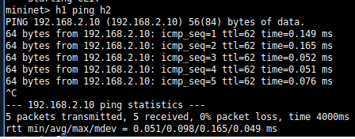
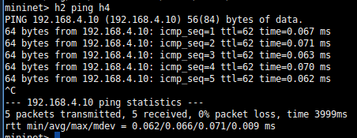
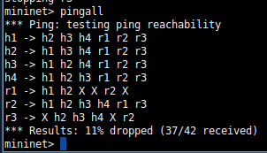

# Roteamento IP com Múltiplos Roteadores no Mininet

Eduardo Costa Braga - RA: 848640

Júlia Vilela Cintra Galvão - RA: 849304

## 1. Descrição da Topologia:

#### A topologia implementada consiste em:
- 4 hosts (h1, h2, h3, h4)
- 3 roteadores (r1, r2, r3)
- 4 redes locais (LAN1, LAN2, LAN3, LAN4)
- 2 redes de enlace entre roteadores

#### Desenho Lógico da Rede:
```
[h1]    [h2]    [h3]
 |       |       |    
[r1]----[r2]----[r3]  
                 | 
                [h4]  
```

#### Endereçamentos IP:
- h1: 192.168.1.10/24 (LAN1)
- h2: 192.168.2.10/24 (LAN2)
- h3: 192.168.3.10/24 (LAN3)
- h4: 192.168.4.10/24 (LAN4)
- r1:
    - r1-eth0: 192.168.1.1/24 (LAN1)
    - r1-eth1: 10.0.0.1/30 (Link r1-r2)
- r2:
    - r2-eth0: 192.168.2.1/24 (LAN2)
    - r2-eth1: 10.0.0.2/30 (Link r1-r2)
    - r2-eth2: 10.0.1.1/30 (Link r2-r3)
- r3:
    - r3-eth0: 192.168.3.1/24 (LAN3)
    - r3-eth1: 192.168.4.1/24 (LAN4)
    - r3-eth2: 10.0.1.2/30 (Link r2-r3)

## 2. Configuração:

```Python
    # Criação dos Hosts
    h1 = net.addHost('h1', ip='192.168.1.10/24')
    h2 = net.addHost('h2', ip='192.168.2.10/24')
    h3 = net.addHost('h3', ip='192.168.3.10/24')
    h4 = net.addHost('h4', ip='192.168.4.10/24')
    
    # Criação dos Roteadores
    r1 = net.addHost('r1')
    r2 = net.addHost('r2')
    r3 = net.addHost('r3')
    
    # Conexões entre Hosts e Roteadores
    net.addLink(h1, r1) # LAN1
    net.addLink(h2, r2) # LAN2
    net.addLink(r1, r2) # r1-r2
    net.addLink(h3, r3) # LAN3
    net.addLink(h4, r3) # LAN4
    net.addLink(r2, r3) # r2-r3

    # Configuração dos IPs de cada roteador
    r1.setIP('192.168.1.1/24', intf='r1-eth0') # LAN1
    r1.setIP('10.0.0.1/30', intf='r1-eth1') # r1-r2

    r2.setIP('192.168.2.1/24', intf='r2-eth0') # LAN2
    r2.setIP('10.0.0.2/30', intf='r2-eth1') # r2-r1
    r2.setIP('10.0.1.1/30', intf='r2-eth2') # r2-r3

    r3.setIP('192.168.3.1/24', intf='r3-eth0') # LAN3
    r3.setIP('192.168.4.1/24', intf='r3-eth1') # LAN4
    r3.setIP('10.0.1.2/30', intf='r3-eth2') # r3-r2

    # Configuração das rotas Default de cada Host
    h1.cmd('ip route add default via 192.168.1.1')
    h2.cmd('ip route add default via 192.168.2.1')
    h3.cmd('ip route add default via 192.168.3.1')
    h4.cmd('ip route add default via 192.168.4.1')

    # Habilitar o roteamento em cada Roteador
    for router in [r1, r2, r3]:
        router.cmd('sysctl -w net.ipv4.ip_forward=1')
    
    # Caminho de r1 para alcançar h2/h3/h4 por r2
    r1.cmd('ip route add 192.168.2.0/24 via 10.0.0.2')
    r1.cmd('ip route add 192.168.3.0/24 via 10.0.0.2')
    r1.cmd('ip route add 192.168.4.0/24 via 10.0.0.2')
    
    # Caminho de r2 pra alcançar h1 por r1 e h3/h4 por r3
    r2.cmd('ip route add 192.168.1.0/24 via 10.0.0.1')
    r2.cmd('ip route add 192.168.3.0/24 via 10.0.1.2')
    r2.cmd('ip route add 192.168.4.0/24 via 10.0.1.2')

    # Caminho de r3 pra alcançar h1/h2 por r2
    r3.cmd('ip route add 192.168.1.0/24 via 10.0.1.1')
    r3.cmd('ip route add 192.168.2.0/24 via 10.0.1.1')
```

## 3. Rotas Estáticas:

#### Tabela de rotas por roteador:
- Roteador r1:
    - 192.168.2.0/24 (h2) → via 10.0.0.2 (r2)
    - 192.168.3.0/24 (h3) → via 10.0.0.2 (r2)
    - 192.168.4.0/24 (h4) → via 10.0.0.2 (r2)
- Roteador r2:
    - 192.168.1.0/24 (h1) → via 10.0.0.1 (r1)
    - 192.168.3.0/24 (h3) → via 10.0.1.2 (r3)
    - 192.168.4.0/24 (h4) → via 10.0.1.2 (r3)
- Roteador r3:
    - 192.168.1.0/24 (h1) → via 10.0.1.1 (r2)
    - 192.168.2.0/24 (h2) → via 10.0.1.1 (r2)

Cada rota foi necessária para garantir que pacotes destinados a redes não diretamente conectadas possam ser encaminhados corretamente através dos roteadores intermediários. Por exemplo, para que h1 possa se comunicar com h3, o pacote precisa passar por r1 → r2 → r3.


## 4. Testes de Conectividade:
→ h1 ping h2



→ h1 ping h3


→ h1 ping h4


→ h2 ping h3


→ h2 ping h4



→ h3 ping h4


## 5. Conclusão:

#### Dificuldades encontradas:

- Conseguimos configurar a comunicação entre todos os hosts, mas tivemos dificuldade na comunicação entre r1 e r3, mesmo depois de todos os testes entre os hosts terem sido bem-sucedidos. Ainda não sabemos o motivo dessa falha, mas acreditamos que, pela comunicação entre r1 e r3 depender da rede intermediária r2, faz com que esses roteadores não consigam se "enxergar" diretamente entre si.

- 

- Além disso, um dos maiores desafios, foi o processo de exportação/importação do script em python constante para conseguir fazer os ajustes necessários.

- 

#### Aprendizados:

- Durante os testes, aprendemos que a ordem que os links são adicionados influencia diretamente na numeração das interfaces de rede (ethX). 
- Ademais, percebemos a necessidade de usar o IP da rede, e não diretamente do Host, para definir as rotas.

#### Sugestões de melhoria:

- Criação de funções auxiliares para configurar roteadores, atribuir IPs e adicionar rotas, fazendo do código mais modularizado e legível.
- Ajuste de rotas para garantir que todos os componentes consigam se conectar devidamente. 