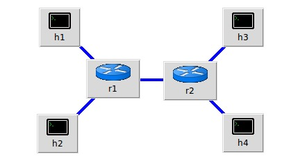
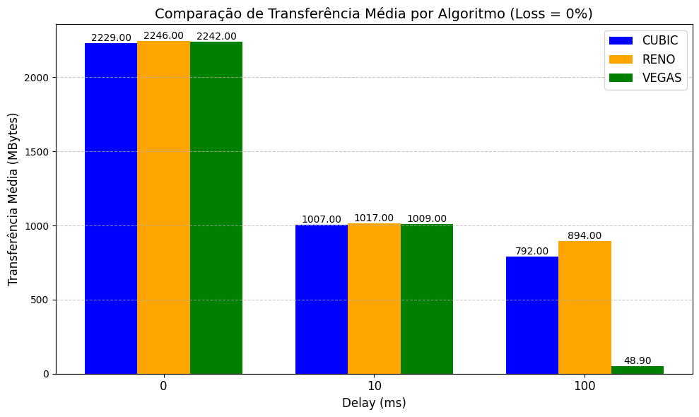
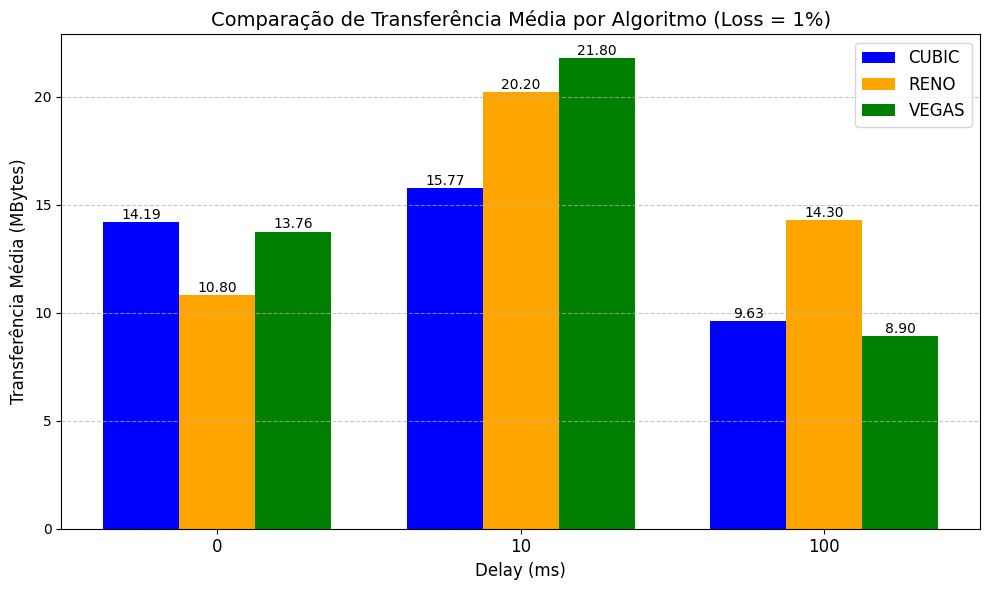
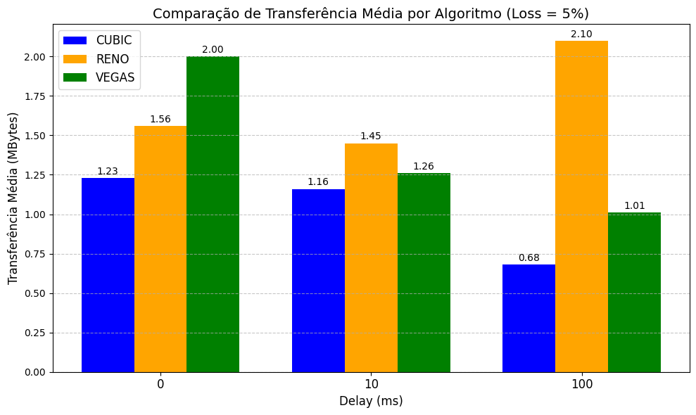

# Análise de Desempenho em Topologia Dumbbell
Eduardo Costa Braga - RA: 848640  
Júlia Vilela Cintra Galvão - RA: 849304

---

## Introdução
Este relatório apresenta a análise do impacto de delay, perda de pacotes (loss) e algoritmos de controle de congestionamento TCP no desempenho de uma rede utilizando uma topologia do tipo dumbbell. O objetivo é identificar como diferentes combinações de parâmetros afetam a performance da rede e determinar qual algoritmo de congestionamento se comporta melhor em diferentes cenários.

---

## Metodologia
### Configuração da Topologia
<!-- A topologia utilizada consiste em: -->
<!-- - **Clientes**: 2 (Host 1 e Host 2)
- **Roteadores**: 2 (Roteador 1 e Roteador 2)
- **Servidores**: 2 (Host 3 e Host 4) -->

<div style="display: flex; flex-direction: row; justify-content: space-between;">
    <div>
        <p>A topologia utilizada consiste em:</p>
        <ul>
            <li><b>Clientes</b>: 2 (Host 1 e Host 2)</li>
            <li><b>Roteadores</b>: 2 (Roteador 1 e Roteador 2)</li>
            <li><b>Servidores</b>: 2 (Host 3 e Host 4)</li>
        </ul>
        <p>Cada cliente se comunica com um servidor através dos roteadores. A simulação foi realizada utilizando o <b>Mininet</b>. Para facilitar a troca de parâmetros, um script em python foi exportado, configurado para aplicar automaticamente os parâmetros de teste na topologia simulada e importado.</p>
    </div>
    
</div>

<!--  -->

<!-- Cada cliente se comunica com um servidor através dos roteadores. A simulação foi realizada utilizando o **Mininet**. Para facilitar a troca de parâmetros, um script em python foi exportado, configurado para aplicar automaticamente os parâmetros de teste na topologia simulada e importado. -->

### Parâmetros Variados
1. **Algoritmos de Congestionamento TCP**: RENO, CUBIC, VEGAS
2. **Delay**: 0ms, 10ms, 100ms
3. **Loss**: 0%, 1%, 5%

### Procedimentos
1. Configuração da topologia dumbbell no Mininet: [*Ver o script completo*](https://github.com/Dudubraga/Redes-de-Computadores/tree/main/Topologia_Dumbbell/script_mininet.py)
```python
24.    r2 = net.addHost('r2', cls=Node, ip='10.0.10.1/24')
25.    r2.cmd('sysctl -w net.ipv4.ip_forward=1')
26.    r1 = net.addHost('r1', cls=Node, ip='192.168.1.1/24')
27.    r1.cmd('sysctl -w net.ipv4.ip_forward=1')
```
```python
30.    h1 = net.addHost('h1', cls=Host, ip='192.168.1.10/24')
31.    h4 = net.addHost('h4', cls=Host, ip='10.0.20.20/24')
32.    h2 = net.addHost('h2', cls=Host, ip='192.168.2.20/24')
33.    h3 = net.addHost('h3', cls=Host, ip='10.0.10.10/24')
```
```python
36.    net.addLink(r1, r2, cls=TCLink, delay=d, loss=l)
37.    net.addLink(r2, h3)
38.    net.addLink(h2, r1)
39.    net.addLink(r2, h4)
40.    net.addLink(h1, r1)
```
```python
45.    r1.cmd('ifconfig r1-eth2 192.168.1.1/24')
46.    r1.cmd('ifconfig r1-eth1 192.168.2.1/24')
47.    r1.cmd('ifconfig r1-eth0 150.161.192.1/24')
48.
49.    r2.cmd('ifconfig r2-eth0 150.161.192.2/24')
50.    r2.cmd('ifconfig r2-eth1 10.0.10.1/24')
51.    r2.cmd('ifconfig r2-eth2 10.0.20.1/24')
52.
53.    h1.cmd('route add default gw 192.168.1.1')
54.    h2.cmd('route add default gw 192.168.2.1')
55.    h3.cmd('route add default gw 10.0.10.1')
56.    h4.cmd('route add default gw 10.0.20.1')
57.
58.    r1.cmd('route add default gw 150.161.192.2')
59.    r2.cmd('route add default gw 150.161.192.1')
```
2. Variação dos parâmetros.
```python
36.     net.addLink(r1, r2, cls=TCLink, delay=d, loss=l)
...
73.     d = input("Valor do Delay: ") # '0', '10', '100'
74.     p = int(input("Valor da Perda: ")) # 0, 1, 5
```
```python
sudo sysctl -w net.ipv4.tcp_congestion_control="cubic" # ao iniciar a VM para simulação
sudo sysctl -w net.ipv4.tcp_congestion_control="reno"  # ao iniciar a VM para simulação
sudo sysctl -w net.ipv4.tcp_congestion_control="vegas" # ao iniciar a VM para simulação
```
3. Medição do desempenho da rede em cada cenário: [*Ver imagens da medição*](https://github.com/Dudubraga/Redes-de-Computadores/tree/main/Topologia_Dumbbell/images)
    - **Transferência de dados**
    - **Largura de banda (Bandwidth)**
4. Registro dos dados.

---

## Resultados
### Tabelas Comparativas 
#### Algoritmo de Congestionamento TCP: CUBIC
| Delay (ms) | Loss (%) | Transferência (min/avg/max) | Bandwidth (min/avg/max)          |
|------------|----------|-----------------------------|----------------------------------|
| 0          | 0        | 1770 / 2229 / 2640  MBytes  | 15200 / 19160 / 22700 Mbits/sec  |
| 0          | 1        | 2.00 / 14.19 / 26.6 MBytes  | 16.8 / 127.55 / 223   Mbits/sec  |
| 0          | 5        | 0.625 / 1.23 / 2.25 MBytes  | 5.24 / 10.69 / 18.9   Mbits/sec  |
| 10         | 0        | 828 / 1007 / 1120	  MBytes  | 6960 / 8374 / 9600    Mbits/sec  |
| 10         | 1        | 10.1 / 15.77 / 24.0 MBytes  | 84.9 / 132.2 / 201    Mbits/sec  |
| 10         | 5        | 0.384 / 1.16 / 2.25 MBytes  | 3.15 / 10.64 / 18.9   Mbits/sec  |
| 100        | 0        | 619 / 792 / 991	  MBytes  | 5200 / 6639 / 8310    Mbits/sec  |
| 100        | 1        | 6.25 / 9.63 / 18.1  MBytes  | 52.4 / 80.8 / 152     Mbits/sec  |
| 100        | 5        | 0.128 / 0.68 / 1.38 MBytes  | 1.05 / 6.29 / 15.7    Mbits/sec  |

 <div style="page-break-after: always;"></div>

#### Algoritmo de Congestionamento TCP: RENO
| Delay (ms) | Loss (%) | Transferência (min/avg/max) | Bandwidth (min/avg/max)          |
|------------|----------|-----------------------------|----------------------------------|
| 0          | 0        | 1840 / 2246 / 2970  MBytes  | 15800 / 19280 / 25500 Mbits/sec  |
| 0          | 1        | 2.50 / 10.80 / 25.8 MBytes  | 21.0 / 90.6 / 216     Mbits/sec  |
| 0          | 5        | 0.128 / 1.56 / 3.25 MBytes  | 1.05 / 12.3 / 27.3    Mbits/sec  |
| 10         | 0        | 704 / 1017 / 1190	  MBytes  | 5910 / 8530 / 10200   Mbits/sec  |
| 10         | 1        | 3.88 / 20.20 / 34.2 MBytes  | 32.5 / 170.6 / 287    Mbits/sec  |
| 10         | 5        | 0.640 / 1.45 / 2.88 MBytes  | 5.24 / 12.1 / 24.1    Mbits/sec  |
| 100        | 0        | 225 / 894 / 1340	  MBytes  | 1890 / 7490 / 11500   Mbits/sec  |
| 100        | 1        | 6.88 / 14.30 / 27.6 MBytes  | 57.7 / 120.3 / 232    Mbits/sec  |
| 100        | 5        | 0.00 / 2.10 / 17.2  MBytes  | 0.00 / 17.5 / 145     Mbits/sec  |

#### Algoritmo de Congestionamento TCP: VEGAS
| Delay (ms) | Loss (%) | Transferência (min/avg/max) | Bandwidth (min/avg/max)          |
|------------|----------|-----------------------------|----------------------------------|
| 0          | 0        | 1610 / 2242 / 2890  MBytes  | 13800 / 19270 / 24900 Mbits/sec  |
| 0          | 1        | 3.62 / 12.30 / 29.8 MBytes  | 30.4 / 103.3 / 250    Mbits/sec  |
| 0          | 5        | 0.00 / 1.68 / 5.62  MBytes  | 0.00 / 13.4 / 47.2    Mbits/sec  |
| 10         | 0        | 904 / 1009 / 1060	  MBytes  | 7580 / 8600 / 9130    Mbits/sec  |
| 10         | 1        | 10.0 / 21.80 / 54.6 MBytes  | 83.9 / 183.2 / 458    Mbits/sec  |
| 10         | 5        | 0.00 / 1.26 / 4.88  MBytes  | 0.00 / 10.6 / 40.9    Mbits/sec  |
| 100        | 0        | 3.50 / 48.90 / 341  MBytes  | 29.4 / 410.6 / 2860   Mbits/sec  |
| 100        | 1        | 4.88 / 8.90 / 16.9  MBytes  | 40.9 / 74.8 / 142     Mbits/sec  |
| 100        | 5        | 0.640 / 1.01 / 1.50 MBytes  | 5.24 / 8.06 / 12.6    Mbits/sec  |

[*Ver todas as tabelas*](https://github.com/Dudubraga/Redes-de-Computadores/tree/main/Topologia_Dumbbell/Dados.md)

### Gráficos
 



---

## Discussão e Análise
- Qual algoritmo se comporta melhor em cenários com alta latência?

O algoritmo RENO apresentou o melhor desempenho em cenários com alta latência (Delay = 100ms). Ele manteve uma Transferência Média consistentemente superior em todos os níveis de perda, destacando-se como o mais robusto para lidar com atrasos significativos na rede. O CUBIC teve desempenho razoável em condições de baixa perda (0% e 1%), mas sofreu quedas acentuadas em perdas mais altas (5%). Já o VEGAS apresentou desempenho inferior em quase todos os níveis de perda nesse cenário.

- Qual algoritmo se adapta melhor à perda?
    
O algoritmo RENO foi o mais resiliente à perda de pacotes, mantendo taxas de transferência mais altas em condições de alta perda (5%) em quase todos os valores de Delay (0ms, 10ms e 100ms). O VEGAS teve desempenho competitivo em perdas moderadas (1%), especialmente em Delay = 10ms, mas caiu drasticamente em perdas mais altas. O CUBIC, por sua vez, foi o mais impactado pela perda, sendo competitivo em todos os valores de delay no momento sem perdas, mas obtendo quedas significativas na transferência média em todos os cenários de alta perda.

- Como a combinação de delay e loss afeta a performance?
    
A combinação de delay e loss tem um impacto significativo na performance dos algoritmos. À medida que o delay e a loss aumentam, o desempenho do CUBIC e do VEGAS degrada rapidamente, enquanto o RENO consegue mitigar parcialmente esses efeitos, mantendo taxas de transferência superiores, principalmente em cenários de alta latência.

---

## Conclusão
Com base nos resultados apresentados, é possível concluir que o desempenho dos algoritmos de congestionamento TCP varia significativamente de acordo com as condições de delay e perda de pacotes. A análise detalhada dos dados e gráficos evidencia a importância de escolher o algoritmo de congestionamento adequado para cada cenário de rede. Aqui, o RENO se destacou como o algoritmo mais robusto e versátil, especialmente em condições adversas de alta latência e perda. No entanto, o desempenho dos algoritmos pode variar dependendo das características específicas da rede, reforçando a necessidade de uma análise cuidadosa ao configurar os parâmetros de controle de congestionamento.